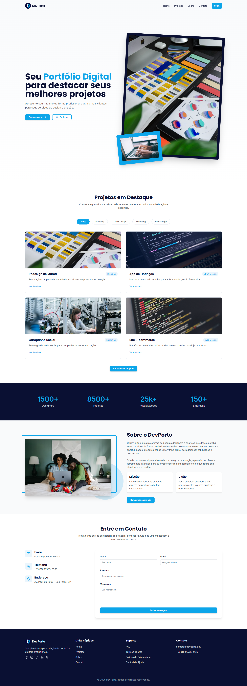

# DevPorto Showcase - Projeto Exemplo

[](https://reactjs.org/) [](https://www.typescriptlang.org/) [](https://vitejs.dev/) [](https://tailwindcss.com/) [](https://ui.shadcn.com/)

**DevPorto Showcase** é um template de aplicação web moderno, ideal como ponto de partida para um portfólio pessoal ou site institucional. Construído com React, TypeScript, Vite e Shadcn/UI, ele oferece uma base sólida e estilizada para apresentar projetos, informações e habilidades.

## ✨ Funcionalidades

*   **Landing Page Abrangente:** Uma página inicial dividida em seções comuns como Hero, Projetos em Destaque, Estatísticas, Sobre, Contato e Rodapé.
*   **Design Moderno e Responsivo:** Interface construída com Shadcn/UI e Tailwind CSS, garantindo boa aparência em diferentes dispositivos.
*   **Página de Login Estilizada:** Inclui um formulário de login (email/senha) com design customizado (autenticação não implementada).
*   **Navegação Básica:** Roteamento configurado entre a página inicial e a página de login.
*   **Componentes Reutilizáveis:** Estrutura organizada com componentes React.
*   **Notificações:** Sistema de Toasts (notificações curtas) integrado.
*   **Tooltips:** Suporte a dicas de contexto (tooltips).
*   **Base Tecnológica Moderna:** Utiliza Vite para build rápido, TypeScript para segurança de tipos e TanStack Query para potencial gerenciamento de dados assíncronos.

##  Demo

(https://devporto-showcase.vercel.app/)




## 🚀 Começando

Siga estas etapas para configurar o ambiente de desenvolvimento localmente.

**Pré-requisitos:**

*   Node.js (versão 18 ou superior recomendada) - [Instalar com NVM](https://github.com/nvm-sh/nvm#installing-and-updating)
*   npm (geralmente vem com o Node.js) ou Bun (opcional)

**Instalação:**

```bash
# 1. Clone o repositório
git clone <URL_DO_SEU_REPOSITORIO_GIT>
# ou use a URL fornecida pelo Lovable se aplicável

# 2. Navegue até o diretório do projeto
cd <NOME_DO_SEU_PROJETO> # Ex: cd devporto-showcase

# 3. Instale as dependências
npm install
# ou 'bun install' se estiver usando Bun

# 4. Inicie o servidor de desenvolvimento
npm run dev
# ou 'bun dev'
```

Abra [http://localhost:5173](http://localhost:5173) (ou a porta indicada no terminal) no seu navegador para ver a aplicação.

## 🛠️ Tecnologias Utilizadas

*   **Framework Frontend:** [React](https://reactjs.org/) 18.3.1
*   **Linguagem:** [TypeScript](https://www.typescriptlang.org/) 5.5.3
*   **Build Tool:** [Vite](https://vitejs.dev/) 5.4.1
*   **Estilização:** [Tailwind CSS](https://tailwindcss.com/) 3.4.11
*   **Componentes UI:** [Shadcn/UI](https://ui.shadcn.com/) (utilizando [Radix UI](https://www.radix-ui.com/))
*   **Roteamento:** [React Router DOM](https://reactrouter.com/) 6.26.2
*   **Gerenciamento de Formulários:** [React Hook Form](https://react-hook-form.com/) 7.53.0
*   **Validação de Esquema:** [Zod](https://zod.dev/) 3.23.8
*   **Gerenciamento de Estado Assíncrono:** [TanStack Query](https://tanstack.com/query/latest) 5.56.2
*   **Linting:** [ESLint](https://eslint.org/) 9.9.0
*   **Formatação:** (Considere adicionar Prettier)

## 📁 Estrutura do Projeto

```
.
├── public/                   # Arquivos estáticos (imagens, fontes, etc.)
├── src/                      # Código fonte da aplicação
│   ├── components/           # Componentes React reutilizáveis
│   │   └── ui/               # Componentes base do Shadcn/UI (se gerados aqui)
│   ├── hooks/                # Hooks customizados
│   ├── lib/                  # Funções utilitárias, configurações (ex: Shadcn utils)
│   ├── pages/                # Componentes que representam páginas/rotas
│   ├── App.css               # Estilos específicos do componente App
│   ├── App.tsx               # Componente raiz da aplicação
│   ├── index.css             # Estilos globais (Tailwind directives)
│   ├── main.tsx              # Ponto de entrada da aplicação (renderiza App)
│   └── vite-env.d.ts         # Declarações de tipos para Vite
├── .eslintrc.cjs             # Configuração do ESLint
├── .gitignore                # Arquivos ignorados pelo Git
├── components.json           # Configuração do Shadcn/UI CLI
├── index.html                # Template HTML principal
├── package.json              # Dependências e scripts do projeto
├── postcss.config.js         # Configuração do PostCSS (para Tailwind)
├── tailwind.config.ts        # Configuração do Tailwind CSS
├── tsconfig.json             # Configuração principal do TypeScript
├── tsconfig.node.json        # Configuração do TypeScript para Node.js (build)
├── vite.config.ts            # Configuração do Vite
└── README.md                 # Este arquivo
```

## 🤝 Contribuindo

Contribuições são bem-vindas! Sinta-se à vontade para abrir issues ou pull requests.

## 📞 Contato

*   **Problemas ou Sugestões:** Abra uma [Issue](https://github.com/Devrpgs/devporto-showcase.git) neste repositório.
*   **Email:** [contato@devporto.dev](mailto:contato@deporto.dev)
*   **Website/Portfólio:** [https://devporto.dev](https://devporto.dev)
*   **(Opcional) LinkedIn:** [https://linkedin.com/in/robsonpgs](https://linkedin.com/in/robsonpgs)

## 📄 Licença

Este projeto é licenciado sob a [Licença MIT](LICENSE).

---

